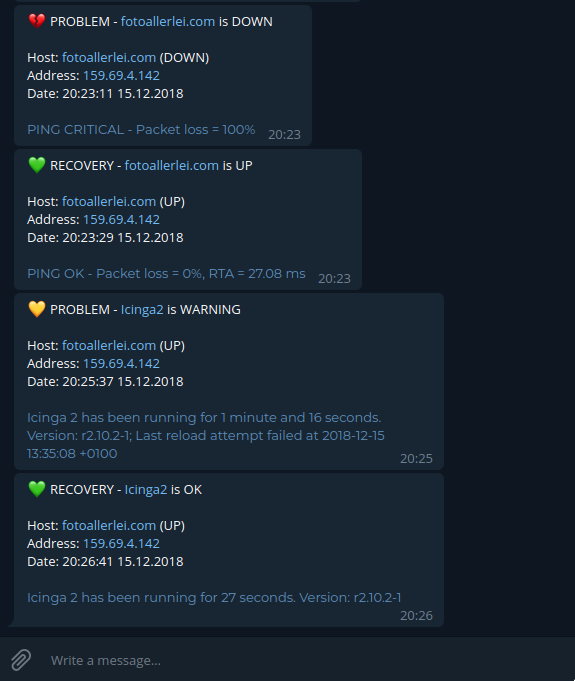

# icinga2telegram

icinga2telegram is a small Python script to send your [Icinga2](https://icinga.com) alerts to
Telegram. It also adds emojis to your alerts to highlight the type and importance of the alert.
(You can disable it with `--no-emojis`.)



## Why Python instead of a simple Bash script?
Several other people implemented Icinga2-Telegram notifications by writing a simple Bash
script. Most of the time this works but there are a few things I do not like about the
Bash solutions:

1. They use two scripts with almost the same content.
2. Bash can screw up really bad when your alert output contains special characters.
3. The Bash solutions are based on environment variables. This does not work natively with
Icinga2 director as it only supports arguments in command definitions.

Obviously the Python implementation has a bigger footprint than the Bash solution. It
requires a Python interpreter and installs several Python packages as dependencies. This
could be a problem for an embedded system with very limited resources but most Icinga2
instances run on powerful machines and the icinga2telegram footprint does not matter there.
In return you get a single maintainable and robust script that you can use for host and
service notifications.

## Installation and Setup

### Install icinga2telegram
It is recommended (but not required) to install icinga2telegram in a Python virtualenv.
```
pip install icinga2telegram
````

Run `icinga2telegram --help` to see all available options.

### Create a Telegram Bot
You need to create a Telegram bot by talking to the Botfather of Telegram. Please follow
the [official instructions](https://core.telegram.org/bots#creating-a-new-bot) and
copy your bot token. You will need it for the Icinga2 configuration.

### Get your CHAT-ID
Now you need to talk to your new bot because a bot can not start a new chat. Just open a
chat with your bot and send a message. Afterwards you have to fetch the CHAT-ID of
the conversation between you and your bot. Replace TOKEN with your actual token.

```
curl -s 'https://api.telegram.org/botTOKEN/getUpdates'
```

If you have `jq` installed it is even simpler with:
```
curl -s 'https://api.telegram.org/botTOKEN/getUpdates' | jq '.result[].message.chat'
{
  "id": CHAT-ID,
  "first_name": "Max",
  "username": "exampleuser",
  "type": "private"
}
```

Copy your CHAT-ID. You will need it for the Icinga2 configuration.
If you want to add more users everyone has to send a message to your bot and you need to
extract the CHAT-IDs as shown above.
(You can also invite your bot to groups but then you have to write a message like `@yourbot foo`
to the group to send the message (with your CHAT-ID) to your bot.)


## Icinga2 Example Configuration

This is just one way to use icinga2telegram for your notifications. Of course you can use another
way to glue your users, CHAT-IDs and the actual notifications together.

### User Definition with your CHAT-ID as a Variable
```
object User "max" {
    display_name = "Max"
    enable_notifications = true
    vars.telegram_chat_id = "CHAT-ID"
}
```

### Notification Definition for Hosts
```
apply Notification "Max (Host)" to Host {
    command = "icinga2telegram Host"
    assign where host.address
    users = [ "max" ]
}
```

### Notification Definition for Services
```
apply Notification "Max (Service)" to Service {
    command = "icinga2telegram Service"
    assign where host.address
    users = [ "max" ]
}

```

### Command Definition for Hosts
```
object NotificationCommand "icinga2telegram Host" {
    import "plugin-notification-command"
    command = [ "/opt/icinga2telegram/bin/icinga2telegram" ]
    timeout = 1m
    arguments += {
        "--address" = "$address$"
        "--chat" = "$user.vars.telegram_chat_id$"
        "--hostdisplayname" = "$host.display_name$"
        "--hostname" = "$host.name$"
        "--hostoutput" = "$host.output$"
        "--hoststate" = "$host.state$"
        "--icingaweb2url" = "https://monitoring.example.com/icingaweb2"
        "--notification-author" = "$notification.author$"
        "--notification-comment" = "$notification.comment$"
        "--notification-type" = "$notification.type$"
        "--time" = "$icinga.timet$"
        "--token" = "TOKEN"
    }
}
```

### Command Definition for Services
```
object NotificationCommand "icinga2telegram Service" {
    import "plugin-notification-command"
    command = [ "/opt/icinga2telegram/bin/icinga2telegram" ]
    timeout = 1m
    arguments += {
        "--address" = "$address$"
        "--chat" = "$user.vars.telegram_chat_id$"
        "--hostdisplayname" = "$host.display_name$"
        "--hostname" = "$host.name$"
        "--hostoutput" = "$host.output$"
        "--hoststate" = "$host.state$"
        "--icingaweb2url" = "https://monitoring.example.com/icingaweb2"
        "--notification-author" = "$notification.author$"
        "--notification-comment" = "$notification.comment$"
        "--notification-type" = "$notification.type$"
        "--servicedisplayname" = "$service.display_name$"
        "--servicename" = "$service.name$"
        "--serviceoutput" = "$service.output$"
        "--servicestate" = "$service.state$"
        "--time" = "$icinga.timet$"
        "--token" = "TOKEN"
    }
}
```

## License
```
Send your Icinga2 alerts to Telegram
Copyright (C) 2018  Max Rosin

This program is free software: you can redistribute it and/or modify
it under the terms of the GNU General Public License as published by
the Free Software Foundation, either version 3 of the License, or
(at your option) any later version.

This program is distributed in the hope that it will be useful,
but WITHOUT ANY WARRANTY; without even the implied warranty of
MERCHANTABILITY or FITNESS FOR A PARTICULAR PURPOSE.  See the
GNU General Public License for more details.

You should have received a copy of the GNU General Public License
along with this program.  If not, see <https://www.gnu.org/licenses/>.
```
